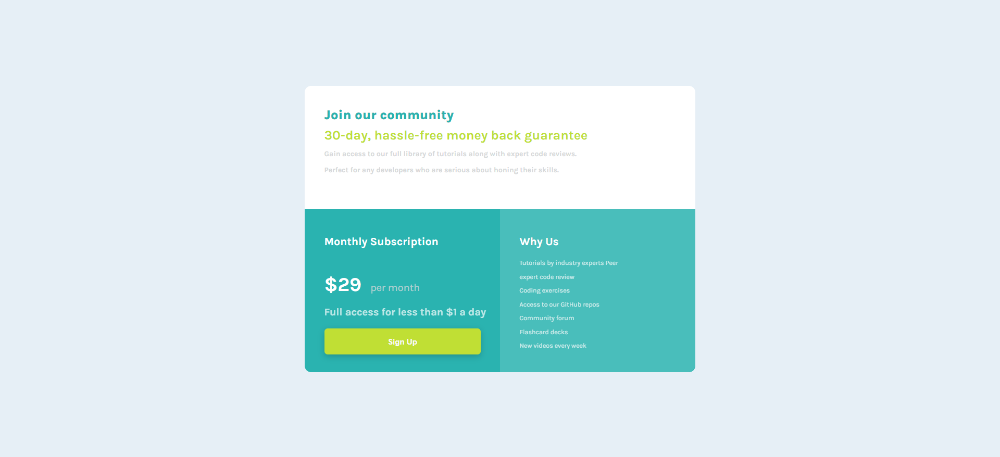

# Frontend Mentor - Single price grid component solution

This is a solution to the [Single price grid component challenge on Frontend Mentor](https://www.frontendmentor.io/challenges/single-price-grid-component-5ce41129d0ff452fec5abbbc). Frontend Mentor challenges help you improve your coding skills by building realistic projects. 

## Table of contents

- [Overview](#overview)
  - [The challenge](#the-challenge)
  - [Screenshot](#screenshot)
  - [Links](#links)
- [My process](#my-process)
  - [Built with](#built-with)
  - [What I learned](#what-i-learned)
  - [Continued development](#continued-development)
  - [Useful resources](#useful-resources)
- [Author](#author)
- [Acknowledgments](#acknowledgments)

**Note: Delete this note and update the table of contents based on what sections you keep.**

## Overview

### The challenge

Users should be able to:

- View the optimal layout for the component depending on their device's screen size
- See a hover state on desktop for the Sign Up call-to-action

### Screenshot
This is a screenshot of my solution below.

### Links

- Solution URL: [Add solution URL here](https://your-solution-url.com)
- Live Site URL: [Add live site URL here](https://your-live-site-url.com)

## My process

### Built with

- HTML5 markup
- CSS custom properties
- Flexbox

*
### What I learned

I had to relearn media query as i have been using bootstrap for a while now so decided to make a switch without the use of any frame work.
This challenge took me back to basics haha.

`

### Continued development

### Useful resources

- [resource 1](https://stackoverflow.com/questions/6370690/media-queries-how-to-target-desktop-tablet-and-mobile) - This helped me for the device sizes in order to be able to achieve the mobile responsive view. 
- [resource 2](https://stackoverflow.com/questions/10835500/how-to-change-text-transparency-in-html-css) - This is an amazing read as i had difficulty toning the look of some font cripsness it helped helped me understanding opacity in css. I'd recommend it to anyone still learning this concept.

## Author

- Website - [Add your name here](http://www.majormichael.com.ng/)
- Frontend Mentor - [@yourusername](https://www.frontendmentor.io/profile/majormichael77)

## Acknowledgments

I acknowledge my mentor Robert Mion who has been pushing me to become a better developer and take up front-end challenges in order for me to keep growing.Thank you Coach!